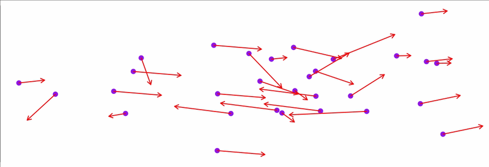
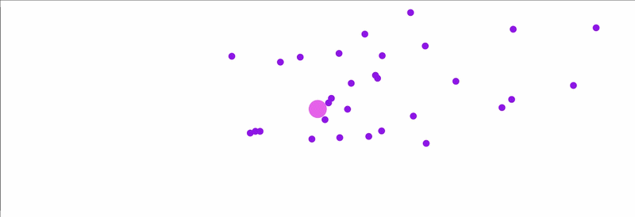
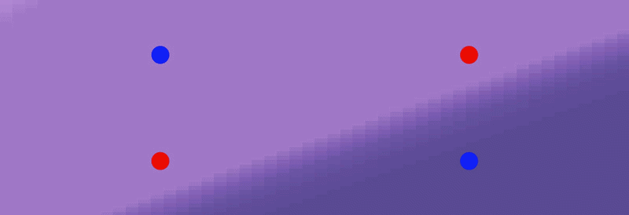

# Testing Nearest Neighbor Velocity Matching and Craziness 
Each particle matches its nearest neighbor's velocity. Eventually, particles form groups that move in parallel in the same direction

# Testing Cornfield Vector
Particles navigate the space to minimize a target function representing their roost. Utilizing both individual memory and shared global knowledge, they exhibit swarm behaviour

# Testing Multidimensional Search 
Keeping the same algorithm structure, the swarm learns to classify a non-linear problem (XOR) by optimizing a Neural Network with 2 inputs, 1 hidden layer (3 neurons) and 1 output

